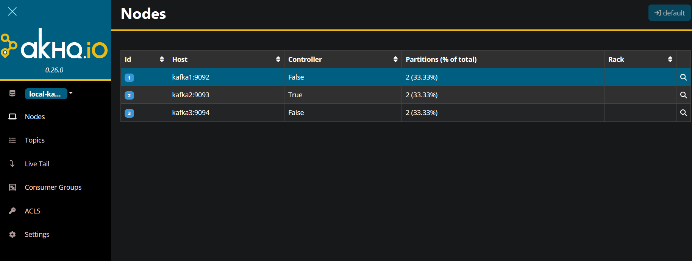
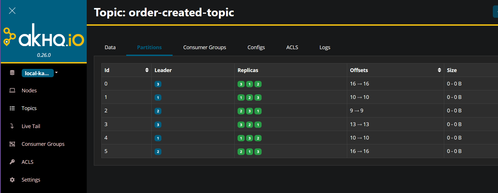

# Order – Kafka Outbox Demo

This repository demonstrates an event-driven Order workflow using:

- ASP.NET Core services
- Postgres with the Outbox pattern
- MassTransit + Apache Kafka for messaging
- A 3-broker Kafka cluster (`kafka1`, `kafka2`, `kafka3`)
- AKHQ for Kafka UI and inspection

## Architecture overview

### Order creation and Outbox pattern

1. A client sends a `POST /api/orders` request to the **Order API**.
2. The Order service:
   - Saves the new Order into **Postgres**.
   - In the same database transaction, inserts an **Outbox** row representing an `OrderCreated` event.
3. The HTTP request completes only after both the Order and its Outbox event are committed.

This ensures that the write to the database and the intent to publish an event cannot get out of sync.

### OrderJobs → Kafka

- The **OrderJobs** service is a background worker that:
  - Periodically reads unprocessed records from the Outbox table in Postgres.
  - For each outbox record, publishes an `OrderCreated` message to Kafka on the topic `order-created-topic`.
  - Marks the outbox record as processed after a successful publish.

This implements the Outbox pattern: it guarantees that every committed Order will eventually produce a corresponding Kafka event, even if the Kafka broker or the service is temporarily unavailable.

#### Outbox polling query (Postgres and SKIP LOCKED)

The OrderJobs service reads pending outbox records from Postgres using a `SELECT ... FOR UPDATE SKIP LOCKED` query. This pattern allows multiple instances of OrderJobs (for example, multiple pods) to run in parallel and safely share the same Outbox table: each instance locks and processes its own batch of rows, while `SKIP LOCKED` tells Postgres to skip rows that are already locked by another instance instead of waiting on them. As a result, no two workers process the same outbox record, and the system can scale horizontally without introducing contention on the Outbox table.

### PharmacyOrder consumer

- The **PharmacyOrder** service subscribes to the `order-created-topic` Kafka topic.
- When it receives an `OrderCreated` event, it:
  - Creates or updates a pharmacy-side representation of the order.
  - Can trigger additional workflows such as notifications, fulfillment, or further domain processing.

This decouples the Order API from PharmacyOrder: they communicate only via Kafka messages.

### PharmacyOrder and Notification consumers (multiple consumer groups)

There are two independent downstream services consuming the same `OrderCreated` events from the `order-created-topic`:

- **PharmacyOrder** service  
  - Subscribes to `order-created-topic` with its own Kafka consumer group (for example, `pharmacy-order-group`).  
  - Handles pharmacy-specific processing for each new order.

- **Notification** service  
  - Subscribes to the same `order-created-topic`, but uses a different consumer group (`notification-group`).  
  - Sends notifications (for example, to users or other systems) whenever a new order is created.

Because they use **different consumer groups**, both services receive every `OrderCreated` message independently and can apply their own processing. This demonstrates a common Kafka pattern: the same event stream can fan out to multiple services, each with its own consumer group and its own offset tracking, without affecting the others.

## Kafka cluster and docker-compose

The repository includes a `docker-compose.yml` that starts:

- `zookeeper`
- `kafka1`, `kafka2`, `kafka3` – three Kafka brokers forming a cluster
- `akhq` – a Kafka UI for inspecting brokers, topics, and messages

High-level setup:

- Each broker has:
  - A unique `KAFKA_BROKER_ID` (1, 2, 3).
  - Internal listeners for broker-to-broker and AKHQ communication.
  - External listeners mapped to localhost ports (e.g. `19092`, `19093`, `19094`) for local .NET apps.
- The cluster is configured so internal Kafka topics (like `__consumer_offsets`) and the main business topic can use a **replication factor of 3** for fault tolerance.

### Starting the cluster

From the repository root, To start the cluster:

```bash
docker compose up -d
```

Docker-compose.yml :
```text
version: '3.8'

services:
  zookeeper:
    image: confluentinc/cp-zookeeper:7.5.0
    container_name: zookeeper
    ports:
      - "2181:2181"
    environment:
      ZOOKEEPER_CLIENT_PORT: 2181
      ZOOKEEPER_TICK_TIME: 2000

  kafka1:
    image: confluentinc/cp-kafka:7.5.0
    container_name: kafka1
    ports:
      - "9092:9092"    # external
      - "19092:19092"  # external
    environment:
      KAFKA_BROKER_ID: 1
      KAFKA_ZOOKEEPER_CONNECT: zookeeper:2181
      KAFKA_LISTENERS: PLAINTEXT_INTERNAL://0.0.0.0:9092,PLAINTEXT_EXTERNAL://0.0.0.0:19092
      KAFKA_ADVERTISED_LISTENERS: PLAINTEXT_INTERNAL://kafka1:9092,PLAINTEXT_EXTERNAL://localhost:19092
      KAFKA_LISTENER_SECURITY_PROTOCOL_MAP: PLAINTEXT_INTERNAL:PLAINTEXT,PLAINTEXT_EXTERNAL:PLAINTEXT
      KAFKA_INTER_BROKER_LISTENER_NAME: PLAINTEXT_INTERNAL
      KAFKA_OFFSETS_TOPIC_REPLICATION_FACTOR: 3
    depends_on:
      - zookeeper

  kafka2:
    image: confluentinc/cp-kafka:7.5.0
    container_name: kafka2
    ports:
      - "9093:9093"
      - "19093:19093"
    environment:
      KAFKA_BROKER_ID: 2
      KAFKA_ZOOKEEPER_CONNECT: zookeeper:2181
      KAFKA_LISTENERS: PLAINTEXT_INTERNAL://0.0.0.0:9093,PLAINTEXT_EXTERNAL://0.0.0.0:19093
      KAFKA_ADVERTISED_LISTENERS: PLAINTEXT_INTERNAL://kafka2:9093,PLAINTEXT_EXTERNAL://localhost:19093
      KAFKA_LISTENER_SECURITY_PROTOCOL_MAP: PLAINTEXT_INTERNAL:PLAINTEXT,PLAINTEXT_EXTERNAL:PLAINTEXT
      KAFKA_INTER_BROKER_LISTENER_NAME: PLAINTEXT_INTERNAL
      KAFKA_OFFSETS_TOPIC_REPLICATION_FACTOR: 3
    depends_on:
      - zookeeper

  kafka3:
    image: confluentinc/cp-kafka:7.5.0
    container_name: kafka3
    ports:
      - "9094:9094"
      - "19094:19094"
    environment:
      KAFKA_BROKER_ID: 3
      KAFKA_ZOOKEEPER_CONNECT: zookeeper:2181
      KAFKA_LISTENERS: PLAINTEXT_INTERNAL://0.0.0.0:9094,PLAINTEXT_EXTERNAL://0.0.0.0:19094
      KAFKA_ADVERTISED_LISTENERS: PLAINTEXT_INTERNAL://kafka3:9094,PLAINTEXT_EXTERNAL://localhost:19094
      KAFKA_LISTENER_SECURITY_PROTOCOL_MAP: PLAINTEXT_INTERNAL:PLAINTEXT,PLAINTEXT_EXTERNAL:PLAINTEXT
      KAFKA_INTER_BROKER_LISTENER_NAME: PLAINTEXT_INTERNAL
      KAFKA_OFFSETS_TOPIC_REPLICATION_FACTOR: 3
    depends_on:
      - zookeeper

  akhq:
    image: tchiotludo/akhq:0.26.0
    container_name: akhq
    ports:
      - "8090:8080"
    environment:
      AKHQ_CONFIGURATION: |
        akhq:
          connections:
            local-kafka:
              properties:
                bootstrap.servers: "kafka1:9092,kafka2:9093,kafka3:9094"
              connect-timeout: 10000
              request-timeout: 30000
    depends_on:
      - kafka1
      - kafka2
      - kafka3

```

Then access AKHQ at:

```text
http://localhost:8090
```
### AKHQ
AKHQ is used to:

- Inspect brokers and verify all three nodes are part of the cluster.

- Inspect topics:

   -- Check partitions, leaders, and replicas for order-created-topic.

   -- Confirm replication factor and in-sync replicas (ISR).

- Inspect data:

   -- Browse messages in order-created-topic.

   -- Use Live Tail to watch OrderCreated events as they are produced by the OrderJobs service.

### AKHQ Nodes



### Topic Partitions




